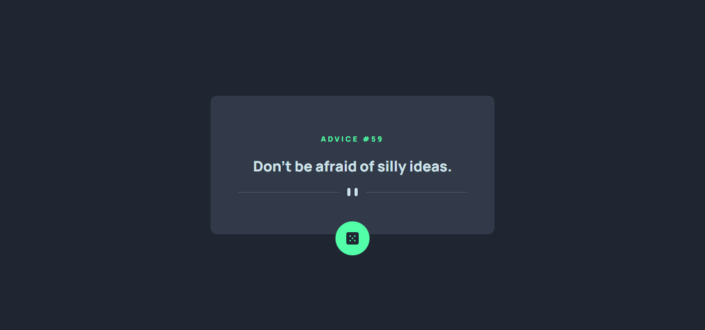
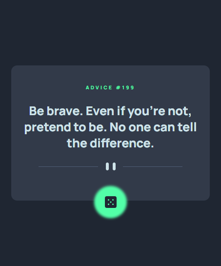

#  🎲 Advice Generator App

A sleek, responsive web app that fetches and displays random pieces of advice from the [Advice Slip API](https://api.adviceslip.com/). Built as part of a challenge from [Frontend Mentor](https://www.frontendmentor.io/challenges/advice-generator-app-QdUG-13db).

## 🛰 Live Demo  
🔗 [View Project](https://bhavikthakur.github.io/advice-generator-app/)  

## 📸 Preview  
  
   

## 📌 Features  
🎲 Fetches random advice with each click of the dice button <br>
📱 Fully responsive design (Mobile, Tablet, Desktop <br>
💡 Lazy-loaded assets for performance <br>
🔁 Dice icon rotates with each request <br>
🔒 Error handling with helpful fallback messages <br>
♿ Accessible with semantic elements and screen-reader support <br>
🌈 Custom theming via CSS variables

## 🛠️ Built With  
- **HTML5**  <br>
- **CSS3 (Custom Properties, Flexbox, Media Queries)** <br>
- **Vanilla JavaScript (Fetch API, DOM Manipulation)** <br>
- **Responsive Design** <br>
- **Accessible Markup (ARIA attributes, keyboard focus)** <br>

## 📂 Folder Structure  
/project-folder <br>
│── /css <br>
│   ├── reset.css        # Resets default browser styles <br>
    |---common.css       # Common styles across web <br>   
│   ├── styles.css       # Main styling file <br>
│   ├── media-queries.css # Responsive styles <br>
│── /images             # Contains all images & icons <br>
│── index.html          # Main HTML file <br>
|--- app.js              # Main Js file <br>
│── README.md           # Documentation <br>


## 🔧 Setup & Usage  
1. Clone this repository:  
   ```bash
   git clone https://github.com/bhavikthakur/advice-generator-app.git  
2. Open index.html in your browser. 

## 🔓 Lessons Learned  
- How to structure a scalable front-end project using atomic CSS principles <br>
- Error handling and debouncing API requests in JavaScript <br>
- Using ARIA attributes and `aria-live` regions for accessible UI updates <br>
- Working with dynamic media assets (`<picture>` element and `source` tag) <br>


## 🤝 Connect With Me  
👨‍💻 GitHub: [bhavikthakur](https://github.com/bhavikthakur)  <br>
💼 LinkedIn: [Bhavik Thakur](https://www.linkedin.com/in/bhavik-thakur/)  <br>
🐦 Twitter: [Bhavik Thakur](https://x.com/BhavikkThakur)  <br>


## 🏁 Challenge Source

This project is part of the [Frontend Mentor](https://www.frontendmentor.io) challenges.
